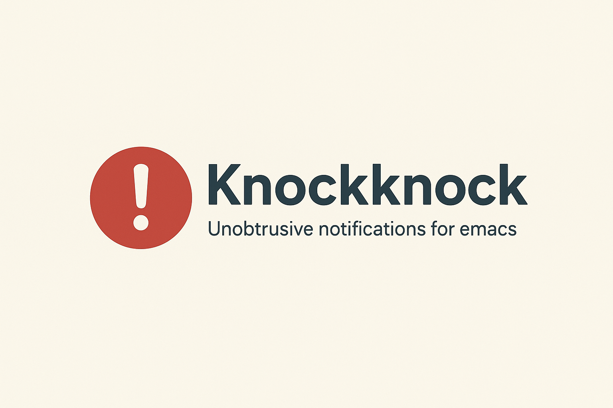
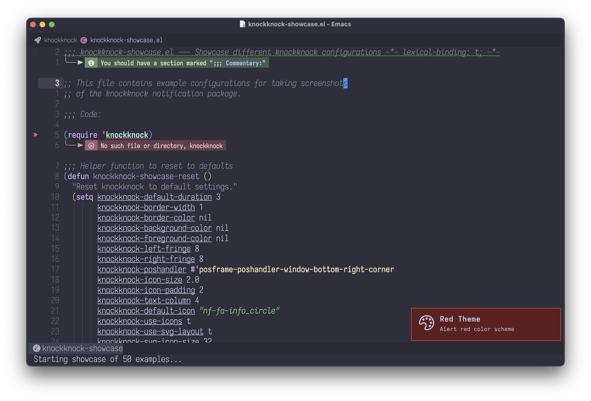
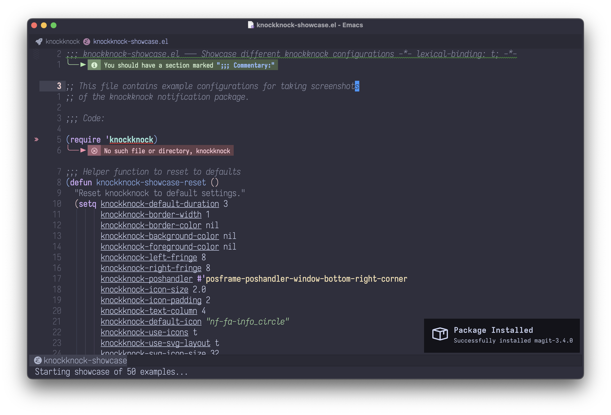
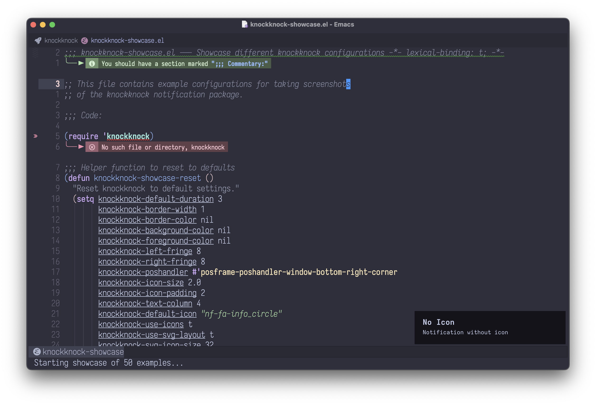
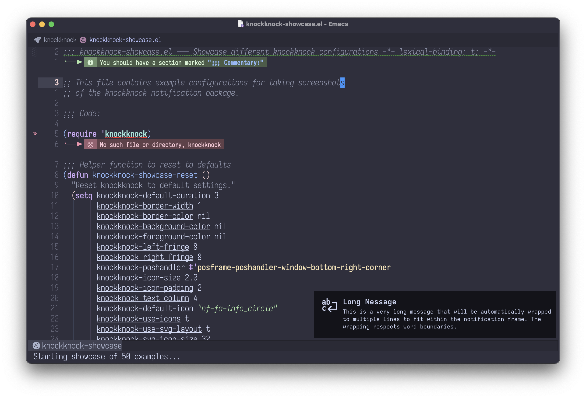
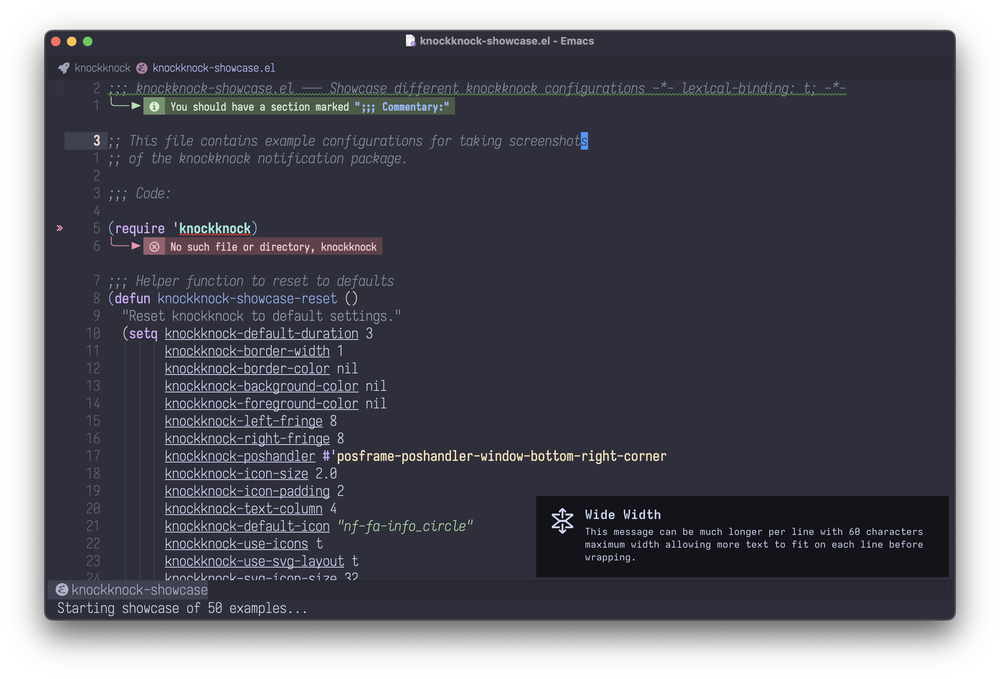
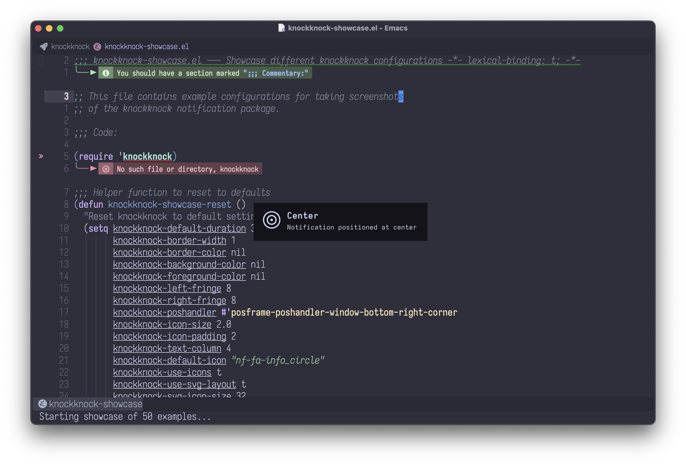
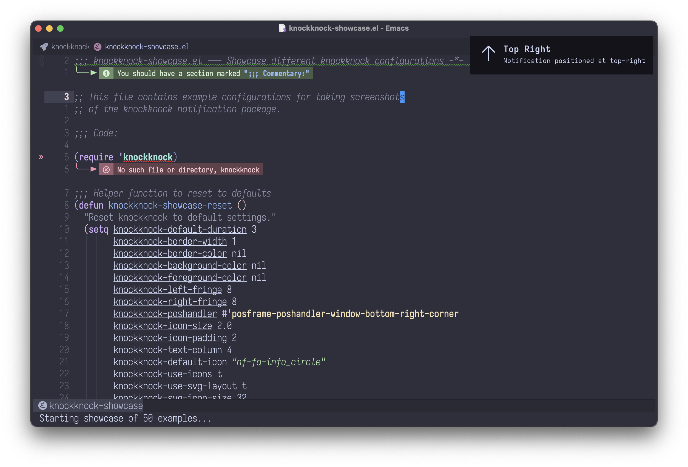
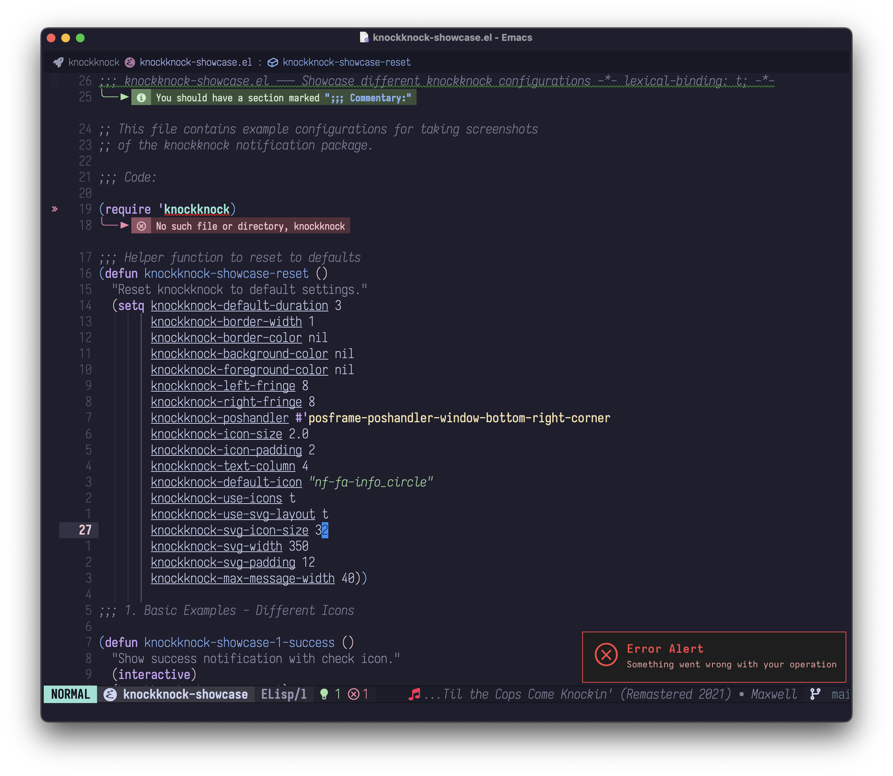
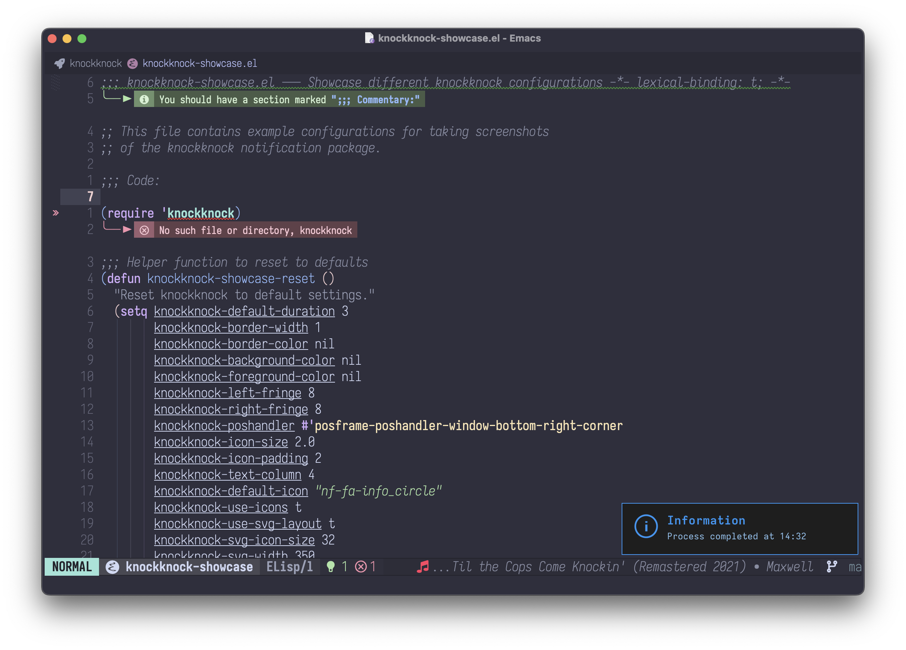

# knockknock

<p align="center">
  
</p>

<p align="center">
  <b>Unobtrusive notifications with icons and SVG support</b>
</p>

knockknock provides beautiful, elegant notifications using posframe and nerd-icons. Display temporary alert messages with custom icons, titles, and messages in a centered, customizable frame that automatically disappears. Features pixel-perfect SVG layout with automatic text wrapping for long messages.

## Support

This package is developed and maintained in my free time. If you find it useful and want to support continued development, consider sponsoring:

💝 [Sponsor on GitHub](https://github.com/sponsors/konrad1977)

Every contribution, no matter how small, is greatly appreciated and helps keep this project alive!

## Features

- Beautiful icon-based notifications with nerd-icons
- **Custom SVG icons**: Use your own SVG files as notification icons
- Two layout modes:
  - **SVG-based** (default): Pixel-perfect positioning with automatic text wrapping
  - **Text-based**: Uses nerd-icons with Emacs text properties
- Two-column layout: icon on left, title and message on right
- Automatic text wrapping for long messages
- New notifications automatically replace current ones
- Clean, centered notification display
- Fully customizable appearance (colors, borders, duration, icon size)
- Auto-dismiss after configurable duration
- Manual dismiss support
- Multiple position handlers available
- **Robust error handling**: Automatic fallback from SVG to text layout on failure
- **XML escaping**: Secure SVG rendering prevents crashes from special characters
- **Smart image sizing**: Temporary max-image-size handling during rendering
- **Debug mode**: Optional debug logging for troubleshooting
- Backward compatible with simple text alerts

## Screenshots

### Basic Notifications

Simple alert with icon and message:



Package installation notification:



### Layout Variations

Notification without icon:



Long message with automatic text wrapping:



Wide notification for longer content:



### Position Options

Center-positioned notification:



Top-right corner notification:



### Custom Text Colors

Dark background with red text (error style):



Dark background with blue text (info style):



## Requirements

- Emacs 26.1 or later
- [posframe](https://github.com/tumashu/posframe)
- [nerd-icons](https://github.com/rainstormstudio/nerd-icons.el)

## Installation

### Manual Installation

1. Clone or download this repository to your local packages directory:
```bash
cd ~/.emacs.d/localpackages
git clone https://github.com/konrad1977/knockknock.git
```

2. Add to your Emacs configuration:
```elisp
(add-to-list 'load-path "~/.emacs.d/localpackages/knockknock")
(require 'knockknock)
```

### Using straight.el

```elisp
(straight-use-package
 '(knockknock :type git :host github :repo "konrad1977/knockknock"))
```

### Using use-package with straight

```elisp
(use-package knockknock
  :straight (:host github :repo "konrad1977/knockknock"))
```

## Usage

### Modern API (with icons)

Display a notification with title and message:

```elisp
(knockknock-notify :title "Build Complete"
                   :message "All tests passed!")
```

Display a notification with custom icon:

```elisp
(knockknock-notify :title "Error"
                   :message "Build failed"
                   :icon "cod-error"
                   :duration 5)
```

Display with only a title:

```elisp
(knockknock-notify :title "Task Complete" :icon "cod-check")
```

Long messages wrap automatically:

```elisp
(knockknock-notify :title "Long Message"
                   :message "This is a very long message that will automatically wrap to multiple lines to fit nicely in the notification"
                   :icon "cod-info"
                   :duration 8)
```

Available icon examples (you can use with or without "nf-" prefix):
- `"cod-check"` or `"nf-cod-check"` - Checkmark
- `"cod-error"` or `"nf-cod-error"` - Error/X
- `"cod-info"` or `"nf-cod-info"` - Information
- `"cod-warning"` or `"nf-cod-warning"` - Warning
- `"fa-rocket"` or `"nf-fa-rocket"` - Rocket
- `"fa-save"` or `"nf-fa-save"` - Save/Disk
- And many more from [nerd-icons](https://github.com/rainstormstudio/nerd-icons.el)

### Custom SVG Icons

You can use your own SVG files as notification icons with the `:icon-file` parameter:

```elisp
(knockknock-notify :title "Custom Icon"
                   :message "Using my own SVG!"
                   :icon-file "~/icons/my-custom-icon.svg")
```

**Notes:**
- Custom SVG icons only work in SVG layout mode (`knockknock-use-svg-layout t`)
- The SVG is automatically scaled to `knockknock-svg-icon-size` (default 32 pixels)
- If `:icon-file` is provided along with `:icon`, the custom file takes precedence
- If the file cannot be loaded, it falls back to the `:icon` or default icon
- In text layout mode, `:icon-file` is ignored and falls back to nerd-icons

### Legacy API (simple text)

Display a notification with default duration (3 seconds):

```elisp
(knockknock-alert "Hello, World!")
```

Display a notification with custom duration (5 seconds):

```elisp
(knockknock-alert "This will show for 5 seconds" 5)
```

### Manual Close

Manually close the current notification:

```elisp
M-x knockknock-close
```

## Customization

All aspects of knockknock can be customized through `M-x customize-group RET knockknock RET` or by setting variables in your configuration:

```elisp
;; Duration
(setq knockknock-default-duration 5)

;; Colors (nil = use theme defaults)
(setq knockknock-background-color nil)  ; Use theme background
(setq knockknock-foreground-color nil)  ; Use theme foreground
(setq knockknock-border-color "orange")

;; Background color adjustments (applied to theme background)
(setq knockknock-darken-background-percent 0)   ; Darken background by percentage (0-100)
(setq knockknock-lighten-background-percent 0)  ; Lighten background by percentage (0-100)

;; Border and spacing
(setq knockknock-border-width 2)
(setq knockknock-left-fringe 10)
(setq knockknock-right-fringe 10)

;; Icon settings
(setq knockknock-use-icons t)                ; Enable/disable icons
(setq knockknock-default-icon "fa-bell")     ; Default icon

;; Debug mode
(setq knockknock-debug nil)                  ; Enable debug logging (default: nil)

;; Text wrapping
(setq knockknock-max-message-width 40)       ; Max characters per line

;; Position (see posframe documentation for available handlers)
(setq knockknock-poshandler #'posframe-poshandler-frame-top-center)
```

### Text Layout Settings

For text-based layout:

```elisp
(setq knockknock-use-svg-layout nil)         ; Switch to text layout
(setq knockknock-icon-size 3.5)              ; Icon size multiplier
(setq knockknock-icon-padding 2)             ; Spaces between icon and text
(setq knockknock-text-column 4)              ; Column position for text
```

### SVG Layout Settings

For SVG-based layout (default):

```elisp
(setq knockknock-use-svg-layout t)           ; SVG layout (default)
(setq knockknock-svg-icon-size 32)           ; Icon size in pixels
(setq knockknock-svg-min-width 300)          ; Minimum canvas width in pixels
(setq knockknock-svg-max-width 500)          ; Maximum canvas width in pixels
(setq knockknock-svg-padding 12)             ; Padding between icon and text
(setq knockknock-left-padding 12)            ; Left padding from edge to icon (pixels)
(setq knockknock-right-padding 16)           ; Right padding from text to edge (pixels)
```

**Note**: Image size limits are handled automatically during rendering. The package temporarily adjusts `max-image-size` when displaying notifications to ensure SVGs render correctly without affecting other parts of Emacs.

### Customizing Faces

You can customize the appearance of titles, messages, and icons:

```elisp
;; Make titles larger and bolder
(set-face-attribute 'knockknock-title-face nil
                    :weight 'bold
                    :height 1.3
                    :foreground "#ff6347")

;; Style the message text
(set-face-attribute 'knockknock-message-face nil
                    :slant 'italic
                    :foreground "#555555")

;; Change icon color
(set-face-attribute 'knockknock-icon-face nil
                    :foreground "#4169e1")
```

### SVG Layout vs Text Layout

| Feature | SVG Layout (default) | Text Layout |
|---------|---------------------|-------------|
| Positioning | Pixel-perfect | Text-flow based |
| Theme integration | Automatic | Automatic |
| Text wrapping | Multi-line support | Multi-line support |
| Icon scaling | Exact pixels | Text properties |
| Custom SVG icons | Supported | Not supported |
| Implementation | Sophisticated | Simple |
| Performance | Slightly slower | Fast |
| Error handling | Automatic fallback | N/A |
| XML safety | Built-in escaping | N/A |
| Crash prevention | Yes | N/A |

**When to use SVG layout (default):**
- You want pixel-perfect control over positioning
- You're building a UI similar to agent-shell
- You need exact icon and text placement
- You want consistent rendering across different themes
- You benefit from automatic error handling and safety features

**When to use text layout:**
- You want simpler, faster rendering
- Text-based layout is sufficient
- You prefer Emacs-native text properties
- Maximum performance is critical

### Available Position Handlers

- `posframe-poshandler-window-bottom-right-corner` (default)
- `posframe-poshandler-frame-center`
- `posframe-poshandler-frame-top-center`
- `posframe-poshandler-frame-bottom-center`
- `posframe-poshandler-point-bottom-left-corner`
- And many more from posframe

## Example Integration

### With compilation

```elisp
(add-hook 'compilation-finish-functions
          (lambda (buf status)
            (if (string-match "^finished" status)
                (knockknock-notify :title "Build Complete"
                                   :message "Compilation successful!"
                                   :icon "cod-check"
                                   :duration 3)
              (knockknock-notify :title "Build Failed"
                                 :message "Compilation failed"
                                 :icon "cod-error"
                                 :duration 5))))
```

### With org-pomodoro

```elisp
(add-hook 'org-pomodoro-finished-hook
          (lambda ()
            (knockknock-notify :title "Pomodoro Complete"
                               :message "Time for a break!"
                               :icon "fa-coffee"
                               :duration 5)))

(add-hook 'org-pomodoro-break-finished-hook
          (lambda ()
            (knockknock-notify :title "Break Over"
                               :message "Back to work!"
                               :icon "fa-clock_o"
                               :duration 5)))
```

### With save notifications

```elisp
(defun my-save-notification ()
  (knockknock-notify :title "File Saved"
                     :message (buffer-name)
                     :icon "fa-save"
                     :duration 2))

(add-hook 'after-save-hook #'my-save-notification)
```

### With Git operations

```elisp
(defun my-git-push-notification ()
  (knockknock-notify :title "Git Push"
                     :message "Successfully pushed to remote"
                     :icon "dev-git"
                     :duration 3))
```

### With long messages (automatic wrapping)

```elisp
(knockknock-notify
  :title "Test Results"
  :message "All 127 tests passed successfully. Code coverage is at 94%. No critical issues found."
  :icon "cod-check"
  :duration 6)
```

### Custom notification functions

```elisp
(defun my-notify-success (msg)
  (knockknock-notify :title "Success"
                     :message msg
                     :icon "cod-check"
                     :duration 3))

(defun my-notify-error (msg)
  (knockknock-notify :title "Error"
                     :message msg
                     :icon "cod-error"
                     :duration 5))

(defun my-notify-info (msg)
  (knockknock-notify :title "Information"
                     :message msg
                     :icon "cod-info"
                     :duration 4))

;; Usage
(my-notify-success "Operation completed!")
(my-notify-error "Something went wrong!")
(my-notify-info "Please review the changes")
```

### Adjusting notification background brightness

Make notifications slightly darker or lighter than your theme:

```elisp
;; Make notifications 5% darker than theme background
(setq knockknock-darken-background-percent 5)

;; Or make them 10% lighter
(setq knockknock-lighten-background-percent 10)

;; Reset to use exact theme color
(setq knockknock-darken-background-percent 0)
(setq knockknock-lighten-background-percent 0)
```

This is useful for making notifications visually distinct from regular buffers while still maintaining theme consistency. Note: If both are set, darken takes precedence.

## Advanced Features

### Automatic Notification Replacement

New notifications automatically replace any currently displayed notification:

```elisp
;; First notification
(knockknock-notify :title "Building..." :icon "cod-loading")

;; This immediately replaces the first one
(knockknock-notify :title "Build Complete" :icon "cod-check")
```

### Text Wrapping Customization

Control how long messages are wrapped:

```elisp
;; Shorter lines (30 characters)
(setq knockknock-max-message-width 30)

;; Longer lines (50 characters)
(setq knockknock-max-message-width 50)
```

### Disabling Icons

Show notifications without icons:

```elisp
(setq knockknock-use-icons nil)
(knockknock-notify :title "No Icon" :message "Just text")
```

## Reliability & Safety

knockknock v0.2.2 includes several improvements for stability and crash prevention:

### Automatic Error Handling

If SVG rendering fails for any reason, the package automatically falls back to text-based layout without user intervention. You'll see a message in `*Messages*` if this happens, but your notification will still display.

### XML Escaping

All text (titles, messages, and icons) is automatically XML-escaped before being inserted into SVG. This prevents crashes from special characters like `<`, `>`, `&`, quotes, etc.

### Smart Image Sizing

The package temporarily adjusts `max-image-size` only during notification display, then immediately restores it. This ensures:
- SVG notifications render correctly
- Other parts of Emacs are not affected
- No global state pollution

### Memory Safety

Image size calculations are kept minimal (default max 500x100 pixels) to avoid memory issues, while still providing beautiful notifications.

## Troubleshooting

### Icons not showing in SVG layout

Make sure you have nerd-icons installed and the font is available system-wide:

```elisp
M-x nerd-icons-install-fonts
```

The font family used is "Symbols Nerd Font Mono". Verify it's installed correctly on your system.

### SVG not rendering or showing blank notifications

The package handles image size limits automatically. If you still have issues:

1. **Enable debug mode** to see what's happening:
   ```elisp
   (setq knockknock-debug t)
   ```
   Check the `*Messages*` buffer for debug output.

2. **Try switching to text layout** temporarily:
   ```elisp
   (setq knockknock-use-svg-layout nil)
   ```

3. **Check for SVG support** in your Emacs build:
   ```elisp
   (image-type-available-p 'svg)  ; Should return t
   ```

### Emacs crashes or memory issues

If you experience crashes:

1. The package now includes **automatic error handling** that falls back to text layout if SVG fails
2. **XML escaping** prevents crashes from special characters in notifications
3. Image size limits are handled **automatically and temporarily** - they don't affect other parts of Emacs

If crashes persist, disable SVG layout:
```elisp
(setq knockknock-use-svg-layout nil)
```

### Theme colors not working

Set background and foreground to nil to use theme defaults:

```elisp
(setq knockknock-background-color nil)
(setq knockknock-foreground-color nil)
```

### Debug Mode

Enable detailed logging to troubleshoot issues:

```elisp
(setq knockknock-debug t)
```

Debug messages appear in the `*Messages*` buffer and include:
- Layout mode selection (SVG vs text)
- SVG rendering progress
- Image creation status
- Error messages with automatic fallback notifications

## Changelog

### v0.2.6 (2025)

**New Features:**
- Added `:icon-file` parameter to `knockknock-notify` for custom SVG icons
- Use your own SVG files as notification icons instead of nerd-icons
- Custom SVGs are automatically scaled to `knockknock-svg-icon-size`
- Graceful fallback to nerd-icons if custom file fails to load

### v0.2.5 (2025)

**Improvements:**
- Added `knockknock-left-padding` and `knockknock-right-padding` customization variables for better SVG layout control
- Changed default fringe values from 0 to 10 pixels for better spacing
- Changed default position handler to `posframe-poshandler-window-bottom-right-corner` for less intrusive notifications
- Improved SVG layout with configurable padding for more precise positioning

### v0.2.2 (2025)

**Bug Fixes & Improvements:**
- Fixed crash issues related to SVG rendering and librsvg
- Added XML escaping for safe SVG text rendering
- Implemented automatic error handling with fallback to text layout
- Smart `max-image-size` handling (temporary adjustment during rendering)
- Added `knockknock-debug` customization variable for optional debug logging
- Improved stability and crash prevention

**Breaking Changes:**
- Removed `knockknock-max-image-size` customization (now handled automatically)

### v0.2.1

- Initial stable release with SVG support
- Two layout modes (SVG and text-based)
- Automatic text wrapping
- Customizable appearance

### v0.2.0

- Added modern API with `knockknock-notify`
- SVG-based pixel-perfect layout
- Icon support via nerd-icons
- Title and message display

## License

MIT License - see LICENSE file for details

## Contributing

Contributions are welcome! Please feel free to submit issues or pull requests.

## Author

Mikael Konradsson
